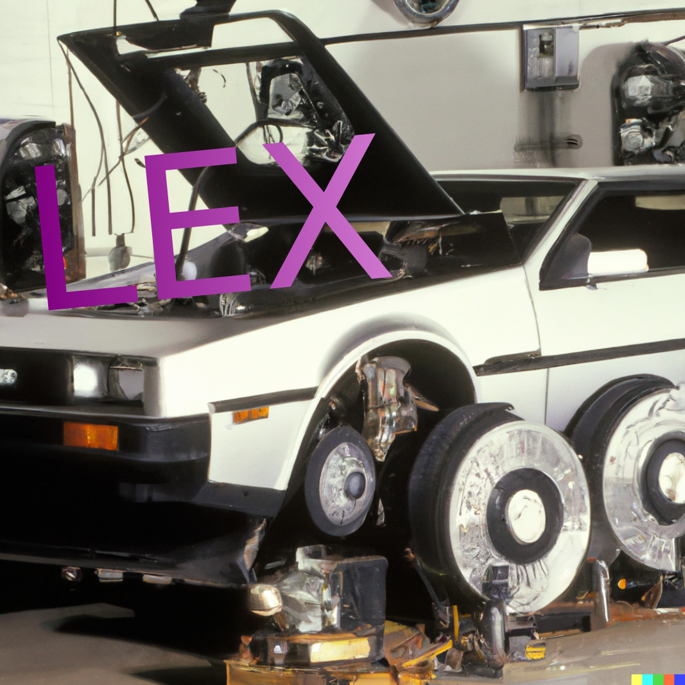

# welcome to LexClinic \[in alpha]!

<figure><figcaption>
Clinic is a legal engineering mechanic's shop
</figcaption></figure>

## why

Concurrently, there remains a need to:

1. pragmatically develop the 'rules of the road' for Internet-native organizations; and
2. expose lawyers & students to the 'rules of the road' for Internet-native organizations (Continuing Legal Education, "CLE");
3. educate the public about the 'rules of the road' for Internet-native organizations (Public Legal Education, "PLE"); and
4. meet Internet-native organizations legal needs at the most prosocial supply & demand curve possible.&#x20;

## alpha mode

The Clinic is still alpha. This means please be patient with us as we figure out our processes. It also means you're more than welcome to help us shape these processes. Feedback is welcome!

