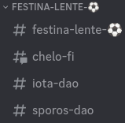

# Discord default

Houses can vary widely from each other.&#x20;

House agents have the final say how their Houses are represented in the Clinic's Discord.

The following is the default structure for Houses.

## open

Discord should be used whenever work is done in the open, which should be as much as possible.

For clients who wish to stay anonymous while doing open work, please visit the [client or project](https://app.gitbook.com/o/Ge5x1XBnN4Zr9dpGqkNC/s/cEok3YduYgyOTvIh4rtP/\~/changes/1/client-or-project) section of this document.

## category

Within the Clinic's Discord, each House gets its own Discord channel.

For instance, `Festina Lente` is the House name and `⚽` is the House emoji, so `FESTINA-LENTE-⚽` is the House category.

## channel

Each channel should be a 'client file' or project.&#x20;

The first channel should be the House as its own 'client file.'

For instance, `festina-lente-⚽` is the first channel in the `FESTINA-LENTE-⚽` category.

The remaining channels should be organized alphabetically from A to Z.

## role

Each channel should have a role.&#x20;

These roles should be used to directly associate Discord profiles with client files and projects.&#x20;

Anyone in the Discord is welcome to use these roles to ping relevant parties.&#x20;
