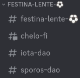

# Discord server

## server rules

* open server for public legal education 'dialectic'
  * **all conversations are done in public**
  * **privilege, confidentiality and privacy is waived**
* **right to be anonymous**
  * equitable access to open server
* **legal or financial advice is forbidden in the server**
  * the line between public education and advice is unclear&#x20;
  * we should continue to govern ourselves on a case-by-case basis, erring on the side of caution
  * successful PLE should supplement law firms, e.g.:&#x20;
    * by going through our 'DAO Startup 101' course, a client should:&#x20;
      1. learn the difference between UNA, LLC or LCA;&#x20;
      2. enough to consider specific questions about those differences within the context of their startup; and
      3. when they engage a law firm, the firm can go straight into answering those specific questions and help the client decide on and form UNA, LLC or LCA.&#x20;

## open

Discord is used whenever work is done in the open, which should be as much as possible.

For clients who wish to stay anonymous while doing open work, please visit the [client or project](../client-or-project/client-or-project.md) section of this document.

## category

Within the Clinic's Discord, each House gets its own Discord channel.

For instance, `Festina Lente` is the House name and `⚽` is the House emoji, so `FESTINA-LENTE-⚽` is the House category.

## channel

Each channel is a 'client file' or project.&#x20;

The first channel is the House as its own 'client file.'

For instance, `festina-lente-⚽` is the first channel in the `FESTINA-LENTE-⚽` category.

The remaining channels are organized alphabetically from A to Z.

## role

Each channel is accompanied by a role.&#x20;

These roles are used to directly associate Discord profiles with clients or projects.&#x20;

Anyone in the Discord is welcome to use these roles to ping relevant parties.&#x20;
